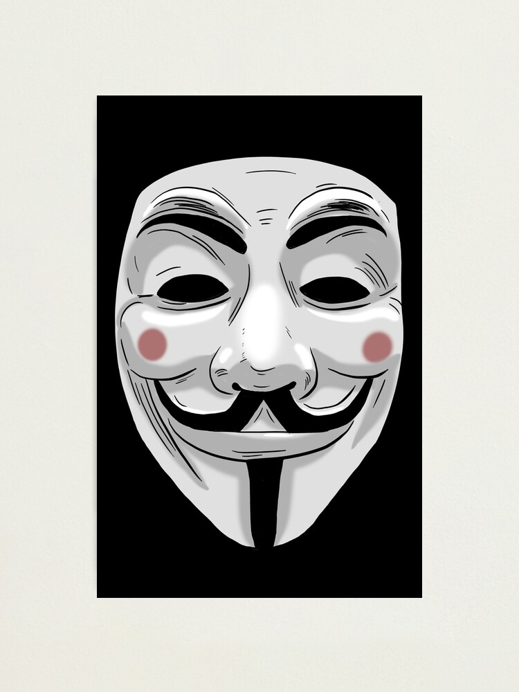

# Lab 18 - Imagem, Textura e Efeitos de Pós-Processamento (Atividade Pontuada)

## Objetivos:

1. Consolidar os conceitos de mapeamento de textura [1];
2. Aprofundar o entendimento de técnicas de processamento de imagem [1];
3. Reforçar a conhecimento prático no uso de texturas, imagens e *shaders* dentro do contexto do *framework Three.JS* [2]. 

# Atividades:

1. As técnicas de pós-processamento [4] [5] disponíveis no *framework Three.JS* podem ser aplicadas tanto em fluxos de imagens sintetizadas pelo *pipeline* gráfico, como vemos na maioria dos exemplos do *Three.JS*, quanto em imagens reais estáticas, com abordado no Lab 17. 

Podemos explorar também a possibilidade de aplicar essas técnicas em fluxos de imagens reais, ou seja, videos, que podem ser pré-gravados ou capturados em tempo real por uma camera (webcam).

Pesquise as ferramentas que o *Three.JS* [3] fornece para visualização de fluxos de imagens reais (video ou captura da webcam). Crie uma aplicação que aplique pelo menos 3 técnicas de pós-processamento a esses fluxos de imagens. A seleção do tipo de pós-processamento deve ser feita via *GUI*. **(valor 1,5)**

2. Técnicas de anonimização em imagens e vídeo permitem descaracterizar pessoas de modo que suas identidades sejam preservadas. Essas técnicas identificam o local onde há rosto e, aplicando alguma estratégia de borramento ou de alguma forma "bloquear" sua identificação. 

APIs como o [face-api.js](https://itnext.io/face-api-js-javascript-api-for-face-recognition-in-the-browser-with-tensorflow-js-bcc2a6c4cf07) permitem a localização facial em imagens e videos de forma simples a fácil.

Dentro desse contexto:

a. Construa uma aplicação utilizando o *Three.JS* e o *face-api.js* para localizar o rosto de uma pessoa em uma imagem. A localização deve ser feita desenhando um plano, em *wireframe*, indicando sua localização. **(valor 2,0)**

b. Modifique a aplicação do item anterior para que uma imagem seja aplicada sobre o rosto da pessoa. Utilize uma imagem simples como os exemplos da Figura abaixo. **(valor 1,5)**

 

c. Substitua a imagem por um modelo 3D de mascara ou rosto [2]. **(valor 2,0)**  

d. Com base nas técnicas de pós-processamento que o *Three.JS* fornece, escolha duas que possam ser aplicadas, apenas na região do rosto da pessoa, para descaracterizar a sua identidade. **(valor 3,0)**

## Observações Importantes:

Tal como os exemplos fornecidos em aula, suas aplicação não devem necessitar de nenhum outro *framework* fora do *Three.js* e do *face-api.js*. Como sugestão, faça com nos labs utilizados no curso, incorporando apenas a parte da *face-api.js* localizada no diretorio *dist*, no seu repositório. 

Modelos, imagens e outros *assets* que voce utilizem também devem estar localizados dentro do seu repositório. 

## Referências:

[1] MARSCHNER, Steve; SHIRLEY, Peter. "**Fundamentals of Computer Graphics**". 5th Edition CRC Press, 2021.

[2] Dirksen, J., **Learn Three.JS: Program 3D animations and visualizations for the web with JavaScript and WebGL**. 4th Edition, Packt Publishing, 2023.

[3]  **Three.JS**, https://threejs.org/ 

[4] **Post Processing**, https://threejs.org/manual/#en/post-processing

[5]  **How to use post-processing**, https://threejs.org/docs/#manual/en/introduction/How-to-use-post-processing 
